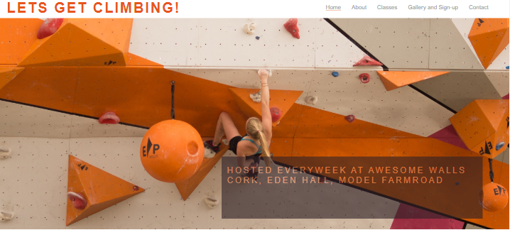
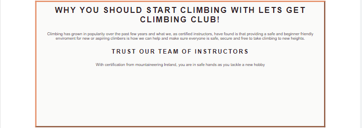
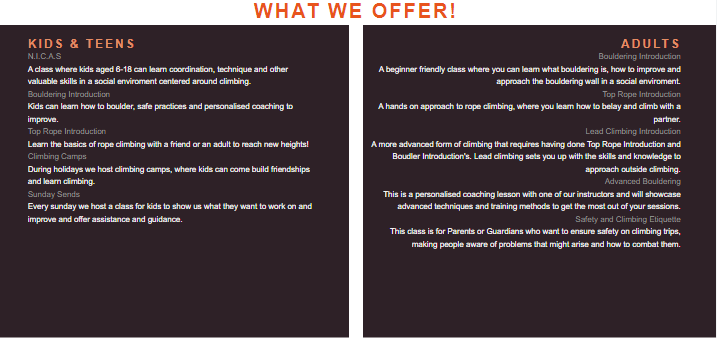
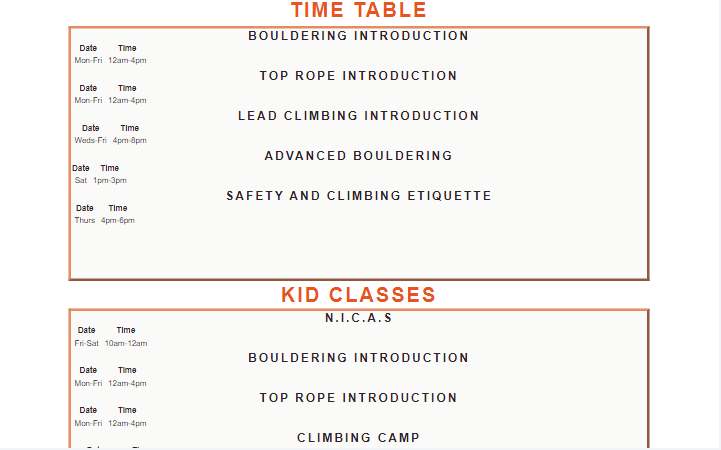
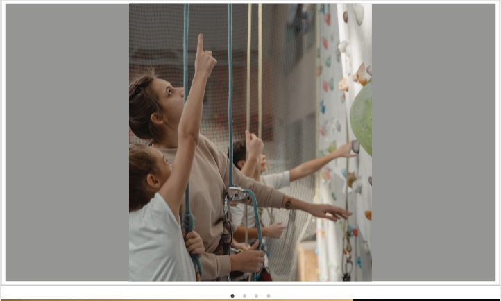
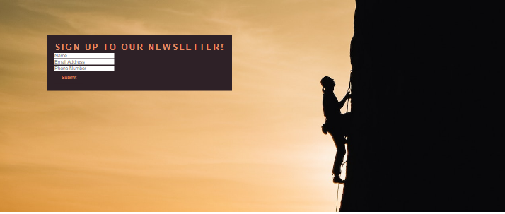
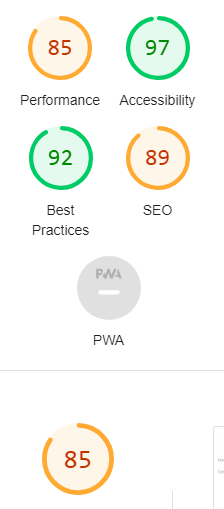

# Lets Get Climbing!
Lets get Climbing is a page for people who want to begin or already are climbing that want to join a community of trained and certified instrucotors to help them advance or possibly go on trips with. Climbing trips take quite a bit of logistics so by creating a page that hosts communal climbing events it takes the pressure off and people can just show up as they want. 

## Features 

In this section, you should go over the different parts of your project, and describe each in a sentence or so. You will need to explain what value each of the features provides for the user, focusing on who this website is for, what it is that they want to achieve and how your project is the best way to help them achieve these things.

### Existing Features

- __Navigation Bar__

  - Featured on both pages, the full responsive navigation bar includes links to the Logo, Home page, Gallery and Sign Up pageand also different sections of the page and is identical in each page to allow for easy navigation.
  - This section will allow the user to easily navigate through the sections and the pages of the website across all devices without having to revert back to the previous page via the ‘back’ button. 

- __The Main Hero Image__

  - The Landing includes a photograph with text overlay to allow the user to see exactly which location this site would be applicable to. 
  - This image follows the color scheme and is eye catching allowing the user to see information about where this is useful for.

- __About__

  - The about section gives the user brief informatio about why you should climb and also about the credibility of our instructors

- __Classes__

  - This section gives information on the classes we provide for both children and adults and brief decription of every class.
  - This section will be updated as we get more classes, and also more locations.

  

- __Class Times__ 

  - This section involves a time table of all our classes and when and where they are held.
 
 

- __Footer__

  - The footer provides contact information and links to social websites.

- __The Gallery and Sign-up Page__

  - The gallery page is an interactive slider giving the user posisitive feedback.
  - This page also includes the sign up to our newsletter allowing for people to sign up and hear about any new events that might occur.

  

### Features Left to Implement

- Another feature idea

## Testing 

- Using Google Dev tools I went about trying to make it responsive and testing all links so that they worked.
I also needed to get the pictures to work in the slider which also faced a problem. 
But through testing, seeing what sizes could fit or how i could orient the pictures it eventually worked. 
- I checked every link, and made sure everything fit my wireframe from balsamiq

### Validator Testing 

- HTML
  - No errors were returned when passing through the official [W3C validator](https://validator.w3.org/nu/?doc=https%3A%2F%2Fcode-institute-org.github.io%2Flove-running-2.0%2Findex.html)
  - Two warnings were present that belonged to different code.
- CSS
  - No errors were found when passing through the official [(Jigsaw) validator](https://jigsaw.w3.org/css-validator/validator?uri=https%3A%2F%2Fvalidator.w3.org%2Fnu%2F%3Fdoc%3Dhttps%253A%252F%252Fcode-institute-org.github.io%252Flove-running-2.0%252Findex.html&profile=css3svg&usermedium=all&warning=1&vextwarning=&lang=en#css)
  - A singular warning.

- Accessibility 
 

- WAVE
 - with a few constast errors that due to layout came about, most came from imported code.

### Unfixed Bugs

A problem I had was in Responsiveness, where I couldnt mold the technology to fit into my smaller screen designs due to how i laid out the project, with slightly better knowledge or more time I could figure it out, but just making everything fit onto the screen was a challenge for me. 

## Deployment

- The site was deployed to GitHub pages. The steps to deploy are as follows: 
  - Going through the repository I went into settings and went to the page section.
  - I then selected the main branch and created a domain name of Lets Get Climbing!
  You can find it at this url [Lets Get Climbing](https://haloegen.github.io/get_climbing/gallery.html)

## Credits 

- I used Love Running as an inspiration and I used guidance from my mentor to give me help with certain coding features. I watched the Love running videos to try implementing features and then changing them to my needs as I saw fit.
- I also looked at other climbing websites to see what they offer and what I could possible achieve.

### Content 
- The icons in the footer were taken from [Font Awesome](https://fontawesome.com/)
- The fonts are from [Google Fonts](https://fonts.google.com/)
- The color palette was chosen from [Color Mind](http://colormind.io/)

### Media

- The photos used on the home and gallery page are from [Pexels.com](https://www.pexels.com/)

